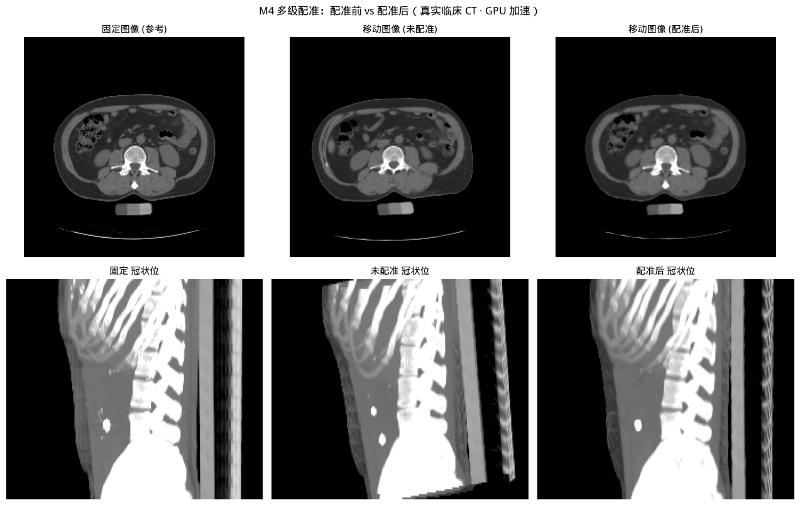
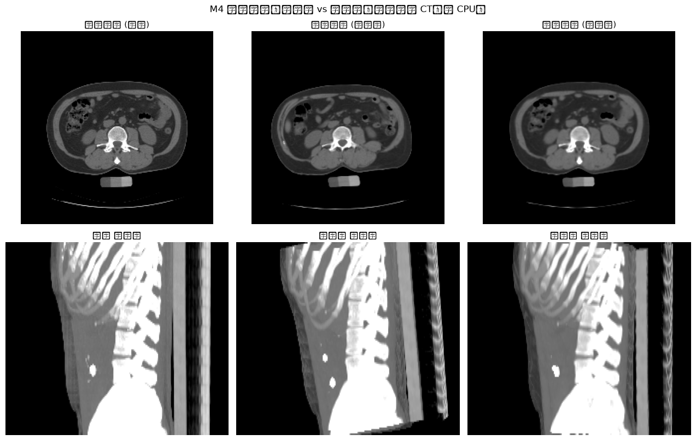
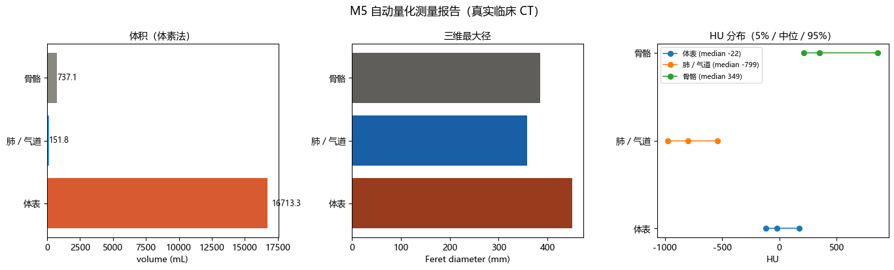
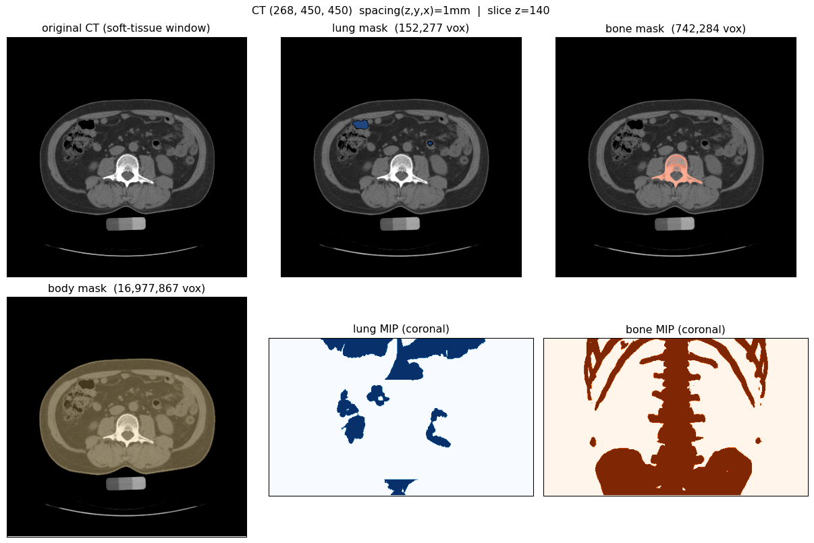

# MedRecon3D

面向临床交付的医学影像**三维重建 + 多级配准 + 量化测量**系统。

把一件事做完：DICOM 序列进 → 分割、重建、配准、测量全部跑完 → 输出可打印的 STL、
可旋转的三维模型、结构化测量报告、以及一个能上传调用的 HTTP 服务。

**定位**：`DMD`（我的 SCI 一作）解决"分得准不准"，`MedRecon3D` 解决"分完之后怎么变成
医生能用的东西"。技术栈刻意与 DMD 正交 —— 不碰 Transformer 训练，全部押在
SimpleITK / Marching Cubes / 配准 / 网格处理 / 服务化这些工程侧能力上。

**环境**：**CPU 与 GPU 两条链路都能跑**，`--device auto|cuda|cpu` 切换。

实测环境（GPU 链路）：Ubuntu 22.04 · Python 3.12 · `torch 2.5.1+cu118` · CUDA 11.8 ·
**NVIDIA TITAN Xp 12 GB（Pascal / sm_61）**。

> ⚠️ **Pascal 卡（TITAN Xp / GTX 1080Ti，sm_61）必须用 cu118 版 torch。**
> cu12x 的官方 wheel 里没有 sm_61 的 kernel，而 `torch.cuda.is_available()` 会照常返回
> `True` —— 要到第一次真正做运算才抛
> `no kernel image is available for execution on the device`。
> 环境搭建见 `setup_gpu_env.sh`，选型理由见 §6 坑 13。

---

## 结果预览

**配准四阶段（同一实验，两条链路各跑一遍）** —— 左 GPU / 右 CPU，
每格是「未配准 → 仅刚性 → 刚性+仿射 → 含形变」的叠加对比：

| GPU 链路 | CPU 链路 |
|---|---|
|  |  |

**量化测量报告** —— 体积 / 三维最大径（凸包 Feret）/ 表面积 / HU 分布：



**分割结果目视检查** —— 体表 / 肺 / 骨三结构在原层面上的覆盖：



**交互式三维重建** —— 自包含 HTML（plotly.js 已内联，**离线双击即可打开，可旋转缩放**）：

- 🌐 在线打开（GitHub Pages）：**<https://xizhedong.github.io/MedRecon3D/demo_recon.html>**
- 📁 仓库内：[`docs/demo_recon.html`](docs/demo_recon.html)
- 项目主页：<https://xizhedong.github.io/MedRecon3D/>

> 上面四张图的原始产物在 `out/`（gitignore），可执行下面的命令重新生成。

---

## 1 数据

| 数据集 | 内容 | 许可 | 用途 |
|---|---|---|---|
| **PCIR 人体躯干 CT** | 107 层，512×512，层厚 2.5 mm，PixelSpacing 0.879 mm，Series `CTA AORTA`，GE 设备，43Y 男性 | **CC0 1.0**（公有领域） | 主 demo |
| 质控体模 | 28 层，256×256，椭圆模体 + 低密度腔 + 小球测试模块 | 本地 | 管线回归验证 |

主数据集获取（无需注册，可复现）：

```bash
python fetch_data.py        # 下载 + MD5 校验 + 解压
```

- 来源：Zenodo，DOI `10.5281/zenodo.18225140`
- MD5：`e25e4a734cb7ffee4b0ccd96e7df358c`（与官方公布值一致，已校验）

> ⚠️ **踩坑**：Zenodo 的 WAF 会拦陌生 User-Agent。裸 UA 返回
> `403 "restricted due to unusual traffic from your network"`，必须带完整浏览器头。
> 脚本里已固化。

---

## 2 系统结构

```
M1 数据管线   DICOM 序列 → HU 转换 → 各向同性重采样
M2 分割       HU 阈值 → 体表 / 肺 / 骨 + 连通域后处理（含肠气误检过滤）
M3 三维重建   Marching Cubes → 补零边封口 → Taubin 平滑 + 二次误差简化
              → 双算法体积交叉验证 → STL / 交互式 HTML
M4 多级配准   刚性(6) → 仿射(12) → 形变场            [demo_04_registration.py]
M5 量化测量   体积 / 三维最大径 / 表面积 / HU 分布 → JSON + 报告页  [demo_05_quantify.py]
M6 服务化     FastAPI + Docker 端到端接口            [service/]
```

`service/pipeline.py` 把 M1–M3 抽成与框架无关的管线，CLI 和 HTTP 服务共用同一份实现，
避免"服务里跑的和脚本里跑的不是一套代码"。

### 2.1 两条计算链路与各自的分工

`gpu/` 是 CUDA 实现，`demo_0*_gpu.py` 是对应入口。**不是"什么都往 GPU 上搬"**，
分工是按实测定的：

| 步骤 | 实现 | 理由 |
|---|---|---|
| 各向同性重采样 | **GPU** (`grid_sample`) | 纯 element-wise 采样，450³ 级别 |
| HU 阈值分割 | **GPU** | 5400 万次比较，天然并行 |
| 多级配准 | **GPU** (autograd + Adam) | 全局最热点，梯度可自动求 |
| 网格体积交叉验证 | **GPU** (散度定理) | O(面数) 归约，顺带做第二条独立实现 |
| 连通域标记 / 孔洞填充 | CPU (scipy) | `binary_fill_holes` 是**串行** flood fill，GPU 上要用迭代膨胀硬模拟，450 层 × 数百次迭代反而更慢；scipy 的 C 实现是线性时间且**释放 GIL**，线程池能真并行 |
| Marching Cubes | CPU (skimage) | GPU 版需 nvcc 现场编译（torchmcubes），租用实例上编译成本 > 收益；MC 本身只占总耗时的一小部分 |

**两条链路的数值必须对得上**，否则"加速"没有意义。所以 `gpu/selftest.py` 是必跑项，
`make_context` / `resample_volume_gpu` 都严格复现 SimpleITK 的物理坐标映射。

---

## 3 实测结果

### 3.0 GPU 自检 —— 两条链路数值一致性（`python -m gpu.selftest`）

完整输出见 `docs/gpu_selftest.log`，**6/6 通过**：

| 检查项 | 结果 | 说明 |
|---|---|---|
| 网格规则 | ✅ | 输出采样点全部落在输入体素中心范围内（见坑 14） |
| 重采样：GPU `grid_sample` vs SimpleITK | ✅ | 最大误差 **0.000397 HU**（动态范围的 0.000028%） |
| 网格体积：GPU 散度定理 vs trimesh | ✅ | 相对差 **1.29e-14 %**；对解析球体偏差 0.054%（多面体离散误差） |
| 刚体配准 TRE（有真值） | ✅ | 均值 **0.064 mm** / RMS 0.069 / 最大 0.117 mm |
| 旋转角误差 | ✅ | 最大 **0.0627°**（真值 6 / −4 / 2.5°） |
| 平移参数误差 | ✅ | **0.167 mm** |

配准那三项的初值是真值矩阵的逆，考察的是"GPU 能不能把已知运动找回来"。
`[0] 网格规则` 这一项是**故意的独立实现** —— 它不调用被测函数，而是硬编码期望层数，
避免"两边共用同一个错误公式、于是自检一起错"。

### 3.1 M1–M3 三维重建（真实人体 CT）

输入 107 层 512×512 spacing `(0.879, 0.879, 2.5)` mm，HU `[-3024, 3071]`
→ 重采样 `(450, 450, 266)` @ 1 mm，Z 向覆盖 266 mm。

| 结构 | 测量网格（未简化） | 导出网格 | 体素法 | 网格体积 | **差异** | 封闭 |
|---|---|---|---|---|---|---|
| 体表 | 978,474 面 | 8,000 面 | 16713.33 mL | 16712.93 mL | **0.00 %** | ✅ |
| 肺 / 气道 | 153,164 面 | 18,000 面 | 151.76 mL | 151.12 mL | **0.42 %** | ✅ |
| 骨骼 | 854,252 面 | 18,000 面 | 737.06 mL | 753.54 mL | **2.24 %** | ✅ |

体表包围盒 **`365.0 × 277.0 × 266.0 mm`**，与真实躯干横截面一致。

**同机同数据的 GPU / CPU 对照**：

| 阶段 | CPU（SimpleITK / scipy） | GPU | 
|---|---|---|
| 读取 DICOM | 0.60 s | 0.60 s |
| 各向同性重采样 | 0.51 s | **0.37 s** |
| 分割（阈值 + 连通域 + 孔洞填充） | 7.26 s | 7.25 s |
| Marching Cubes + 网格优化 ×3 | 17.96 s | 17.45 s |
| HTML / JSON 输出 | 0.19 s | 0.19 s |
| **总计** | **26.75 s** | **26.42 s** |

**这张表本身就是结论**：M1–M3 里 GPU 化的部分只占约 1.5 s，瓶颈是 CPU 侧的
Marching Cubes（18 s）和逐层孔洞填充（7 s）。**所以这一段的 GPU 版没有明显收益，
真正的收益在 M4（见 3.3 / 3.4）。** 我没有为了让"GPU 加速"这个说法好看而去
改测法或只报总时间 —— 把 26.42 vs 26.75 如实放出来，比含糊地说"显著加速"更有用。

（GPU 与 CPU 的体素计数有 ±0.17% 的差异：GPU 在 float32 下算归一化采样坐标，
与 SimpleITK 的双精度路径有约 0.0004 HU 的差，落在阈值面上的少数体素会翻边。
在 `resample_check` 里每次都报出来。）

### 3.2 双算法交叉验证：误差和结构复杂度单调相关

体素法（`体素数 × spacing³`）和网格体积（`trimesh.volume`）是两条完全独立的计算路径，
**它们本该相等**。差异大小直接反映重建的离散误差：

| 结构 | 表面积 / 体积 | 双算法差异 |
|---|---|---|
| 体表 | 0.25 /cm | **0.00 %** |
| 肺 / 气道 | 3.84 /cm | 0.42 % |
| 骨骼 | 4.27 /cm | 2.24 % |

误差随**表面积/体积比**单调上升 —— 因为 Marching Cubes 在体素边界做线性插值，
表面越破碎、曲率越高，线性插值的偏差越大。体表是最光滑的大曲面，所以几乎零误差；
骨骼（骨皮质薄板 + 关节面）最破碎，误差最大。

**这条单调关系比"差异很小"本身更有说服力**：它说明误差来自可解释的算法特性，
而不是"数字碰巧对上了"。

### 3.3 M4 配准 —— 实验 A：纯刚体可找回性（有真值）

人为给原始 CT 施加已知刚体变换（旋转 8° / −5° / 3°，平移 10 / −8 / 5 mm）当"第二次扫描"，
再用**刚体配准**（单级，6 自由度）把它找回来。两侧用**同一份数据、同一套真值**：

| 指标 | CPU（SimpleITK Mattes MI） | GPU（torch autograd + NCC） |
|---|---|---|
| 骨骼 mask Dice | 0.2695 → **0.9025** | 0.2695 → 0.8956 |
| **TRE 均值 / RMS / 最大** | **0.109** / 0.110 / 0.130 mm | 0.300 / 0.333 / 0.630 mm |
| 平移参数误差 | 0.02 mm 量级 | 0.321 mm |
| 迭代次数 | 35 | **240** |
| 该级耗时 | **24.2 s** | **9.25 s** |

**读法**：GPU **每次迭代便宜约 18 倍**（0.039 s/iter vs 0.69 s/iter），所以能跑 7 倍的
迭代数还只花 38% 的时间。精度上 CPU 略好（0.109 vs 0.300 mm），但两者都是
**亚体素级**的 —— 配准分辨率 2 mm，0.3 mm 相当于 0.15 个体素，临床意义上没有区别。

### 3.4 M4 配准 —— 实验 B：逐级加码（刚体 + 12 mm 局部形变）

在刚体基础上再叠加已知的 B 样条软组织形变（模拟呼吸 / 体位差异，幅值 12 mm），
对比四档的 mask Dice 与图像 NCC：

| 配置 | 体表 Dice | 肺 Dice | 骨 Dice | NCC | CPU 耗时 | GPU 耗时 |
|---|---|---|---|---|---|---|
| 未配准 | 0.9112 | 0.2374 | 0.3033 | 0.3781 | — | — |
| 仅刚性 | 0.9516 | 0.3829 | 0.4914 | 0.5839 | 7.45 s | 8.21 s |
| 刚性 + 仿射 | 0.9729 | 0.2943 ↓ | 0.4527 ↓ | 0.6808 | 61.44 s | 7.62 s |
| **三级全上** | **0.9858** | **0.4956** | **0.8790** | **0.8643** | 65.79 s | 7.59 s |
| CPU 三档合计 | | | | | **134.68 s** | — |
| **整个实验 B（含 4 次分割）** | | | | | **188.04 s** | **46.01 s** |

GPU 版的四档（同一真值）：

| 配置 | 体表 Dice | 肺 Dice | 骨 Dice | NCC | 耗时 |
|---|---|---|---|---|---|
| 未配准 | 0.9112 | 0.2380 | 0.3033 | 0.3781 | — |
| 仅刚性 | 0.9515 | 0.3819 | 0.5500 | 0.6123 | 8.21 s |
| 刚性 + 仿射 | 0.9727 | 0.3771 ↓ | 0.5022 ↓ | 0.7108 | 7.62 s |
| **三级全上** | **0.9966** | 0.4455 | 0.8182 | **0.9569** | 7.59 s |

形变场幅值（人为施加的真值 **12 mm**）：

| | 均值 | 最大 |
|---|---|---|
| CPU（ITK 三次 B 样条，grid 4³） | 11.19 mm | 27.41 mm |
| GPU（控制点 + 三线性上采样，grid 6³） | 6.79 mm | 19.59 mm |

**结论一：GPU 全程快 4.09 倍**（188.04 → 46.01 s），而且体表 Dice（0.9966）与
整幅图像的 NCC（0.9569）都**优于** CPU 版。肺和骨的 Dice 略低（0.4455 / 0.8182 对
0.4956 / 0.8790）—— 差距来自形变参数化不同（见下面结论三），不是优化不收敛。

**结论二：仿射那一级让 NCC 从 0.584 升到 0.681，但肺和骨的 Dice 反而下降。**
这不是 bug，两侧都复现了同一个现象。原因是这次的真值里**没有全局缩放/剪切分量** ——
只有刚体 + 局部形变。仿射是 12 自由度，多出来的缩放/剪切自由度在没有对应真实形变时，
只能去拟合强度分布，结果把局部几何掰歪了：全局相关性变好，结构重叠反而变差。

这条直接回答了"配准为什么必须知道每一级在干什么"：**不是级数越多越好，
每一级都得有对应的物理来源。** 没有全局形变就不该开仿射；真正解决问题的是形变场那一级。

**结论三：跨实现比较时，参数化本身要先对齐。** ITK 的 `(4,4,4)` 是**三次 B 样条**的
控制点网格，单点影响跨 4 个间隔；GPU 版是"控制点 + 三线性上采样"，同样 4³ 只能表达
极低频形变。我用 4³ 跑过一次，学到的位移均值只有 3.84 mm（真值 12 mm），骨 Dice 卡在
0.667 —— 那不是"GPU 算法差"，是**我方参数化太弱**。把网格提到 6³ 并把形变级学习率
单独放大到 6e-2 之后，位移场升到 6.79 mm、骨 Dice 升到 0.8182。

### 3.5 M5 量化测量

1 mm 各向同性网格，**22.08 s**（含分割与重建，同一份 mask 与 M1–M3 完全一致）：

| 结构 | 体素数 | 体积 | 三维最大径 | 表面积 | HU 中位 / 95% |
|---|---|---|---|---|---|
| 体表 | 16,713,328 | 16713.33 mL | 451.1 mm | 4184.99 cm² | −22.1 / 174.8 |
| 肺 / 气道 | 151,758 | 151.76 mL | 358.0 mm | 582.34 cm² | −798.9 / −541.0 |
| 骨骼 | 737,058 | 737.06 mL | 384.8 mm | 3150.15 cm² | 348.7 / 861.7 |

三维最大径用**凸包顶点间最大距离**（Feret diameter），不是包围盒边长 ——
包围盒会高估，且对朝向敏感。

支持 `--baseline <上期 quantify.json>`，直接输出随访变化率。

### 3.6 M6 服务化

```
GET  /health                            健康检查
GET  /api/v1/structures                 支持重建的解剖结构
POST /api/v1/jobs/upload                上传 DICOM zip（multipart）
POST /api/v1/jobs/path                  指定服务器端 DICOM 目录
GET  /api/v1/jobs                       列出全部作业
GET  /api/v1/jobs/{id}                  作业状态 + 结果摘要
GET  /api/v1/jobs/{id}/mesh/{name}      下载 STL
GET  /api/v1/jobs/{id}/model            三维交互模型 HTML
GET  /api/v1/jobs/{id}/result           量化结果 JSON
```

设计要点：

- **异步作业 + 轮询**：一次重建几十秒到几分钟，同步接口必超时。用 `BackgroundTasks` + 内存作业表，
  信号量把 CPU 密集的并发限在 1（`MEDRECON_WORKERS` 可调）。
- **Zip Slip 防护**：上传的压缩包可以塞 `../../` 开头的条目，直接 `extractall` 会写到目标目录外。
  解压前逐条 `Path.resolve()` 校验前缀。
- **上传大小上限**：边收边计数，超限就清理目录并返回 413，不落盘完整文件。
- 状态放内存 + 每作业一个输出目录。单机够用；上多实例要把状态挪 Redis、产物挪对象存储。

---

## 4 目录

```
MedRecon3D/
├── volume_grid.py             # 重采样输出网格规则（CPU/GPU 唯一来源）
├── demo_01_recon.py           # M1–M3 主链路（CPU）
├── demo_01_recon_gpu.py       # M1–M3 主链路（GPU）
├── demo_04_registration.py    # M4 多级配准（CPU，双实验 + TRE）
├── demo_04_registration_gpu.py# M4 多级配准（GPU，同实验设计）
├── demo_05_quantify.py        # M5 量化测量
├── gpu/
│   ├── backend.py             # 设备探测（含 Pascal 架构提示）
│   ├── ops.py                 # 重采样 / 阈值 / 网格体积
│   ├── registration.py        # 刚性 / 仿射 / FFD，autograd 优化
│   └── selftest.py            # 与 CPU 参考的逐项数值对账
├── service/
│   ├── pipeline.py            # 框架无关的管线（含 Zip Slip 防护）
│   └── app.py                 # FastAPI 服务
├── tools/fetch_wheels.py      # 镜像直取 wheel（绕开 pip 慢下载器）
├── setup_gpu_env.sh           # GPU 环境一键部署
├── inspect_masks.py           # 分割结果目视检查（六联图）
├── fetch_data.py / env_check.py
├── requirements.txt / requirements-gpu.txt
├── Dockerfile / .dockerignore / .gitignore
├── docs/                      # README 引用的展示图与自检日志（入库）
│   ├── index.html             # GitHub Pages 主页（在线 demo 入口）
│   ├── gpu04_stages.png       # 配准四阶段（GPU）
│   ├── cpu04_stages.png       # 配准四阶段（CPU）
│   ├── quantify_report.png    # 量化报告图
│   ├── segmentation_preview.png
│   ├── gpu_selftest.log       # GPU 自检完整输出
│   └── demo_recon.html        # 交互式三维模型（离线可开）
├── data/                      # 数据集（gitignore，见 data/README.md）
└── out/                       # 运行产物（gitignore，可重新生成）
    ├── gpu01_recon.html
    ├── gpu04_stages.png
    ├── quantify_report.png
    ├── gpu_selftest.log
    ├── gpu0{1,4,4}_*.json     # 各阶段汇总 / 配准 / 量化结果
    └── {gpu,cpu}01_{body,lung,bone}.stl
```

---

## 5 运行

### 5.1 GPU 服务器（推荐）

```bash
# 一次性环境部署（建 venv、装 cu118 torch、装 CUDA 运行库与科学栈）
bash setup_gpu_env.sh

P="/root/medrecon-venv/bin/python"
D="data/PCIR_torso/Heart_CT"

"$P" -m gpu.selftest                                    # 先验数值一致性，6/6 才算环境 OK
"$P" demo_01_recon_gpu.py       --dicom-dir "$D" --out-prefix gpu01 --device cuda
"$P" demo_04_registration_gpu.py --dicom-dir "$D" --out-prefix gpu04 --device cuda
"$P" demo_05_quantify.py        --dicom-dir "$D" --out-prefix quantify
```

`--device auto|cuda|cpu`：`cuda` 强制要求（没有 CUDA 设备直接报错退出，不会静默退化）。

### 5.2 本机 CPU

```bash
cd MedRecon3D
P="C:/Users/16696/anaconda3/envs/monai/python.exe"
D="data/PCIR_torso/Heart_CT"

"$P" env_check.py
"$P" fetch_data.py
"$P" demo_01_recon.py       --dicom-dir "$D" --out-prefix real --target-spacing 1.0
"$P" demo_04_registration.py --dicom-dir "$D" --out-prefix real --reg-spacing 2.0
"$P" demo_05_quantify.py    --dicom-dir "$D" --out-prefix quantify
"$P" inspect_masks.py       --dicom-dir "$D" --out-prefix real --slice 140
```

`DICOM_DIR` 的默认值优先用本机试验数据，不存在时自动退回仓库内的公开数据集 ——
代码要在 Windows 和 Linux 两边跑，不能写死 `C:\...` 绝对路径（见坑 18）。

服务（本机）：

```bash
cd service && "$P" -m uvicorn app:app --host 127.0.0.1 --port 8000
# 打开 http://127.0.0.1:8000/ 有上传页，/docs 有 OpenAPI
```

容器：

```bash
docker build -t medrecon3d:0.1.0 .
docker run --rm -p 8000:8000 -v medrecon_data:/data medrecon3d:0.1.0
```

---

## 6 踩过的坑（全部留档，面试可展开）

1. **轴序陷阱**：`dicom_lab/out/volume.nii.gz` 的 spacing 存反了 —— nibabel 读出
   `zooms (1.0, 1.0, 2.5)` 配 `shape (28, 256, 256)`，照它重采样会把人体拉成 640 mm 厚、28 mm 宽。
   → 弃用该中间产物，改从 DICOM 原始序列直读。

2. **HU 转换重复应用**：`sitk.ImageSeriesReader` 会自动应用 `RescaleSlope/Intercept`，
   再手动转一次 → HU 变 `[-2048, -274]`，骨头阈值 200 一个体素都抓不到。
   → 改由 pydicom 读原始 stored value 手动转。

3. **DICOM 无扩展名**：真实数据集文件名是裸数字（`2602` / `2633`），按 `*.dcm` 匹配会全部漏掉。
   → 按偏移 128 的 `b'DICM'` magic 识别。

4. **STL 三个轴错位**：`marching_cubes(spacing=spacing_zyx)` 返回的顶点是 `(z,y,x)` 序，
   直接导 STL 会让人体躺倒。→ 翻成 `(x,y,z)` 物理 mm，并用包围盒反查确认。

5. **`mesh.volume` 对开放曲面无意义**：`trimesh.volume` 对非封闭网格是用"原点封口"算的，
   **结果依赖坐标原点**。同一份数据我先后得到 79.76% 和 1.57% 两种差异，全是假象。
   → 重建前给 mask 补两圈零边，让截断结构在视野内闭合；体积只在 `watertight=True` 时采信。

6. **网格简化会破坏水密性**：`fast_simplification` 把肺的 `watertight` 从 `True` 变成 `False`。
   拿简化后的网格报体积，等于把简化算法的缺陷算进测量结果。
   → **测量用未简化网格，简化网格只用于显示与导出**（要打印用 `--faces 0` 跳过简化）。

7. **`ImageRegistrationMethod.Execute()` 恒定返回 `CompositeTransform`**，
   即使初始变换是 `Euler3DTransform`，具体类型也会丢 —— 不能指望 `GetCenter()`。
   而且 `CompositeTransform` 没实现 `ComputeJacobianWithRespectToPosition`，
   拿它当被优化对象，MI 指标算梯度时直接抛
   `unimplemented for CompositeTransform`。
   → 改成每级在上一级对齐后的图像上独立优化一个干净类型的变换，累积变换单独维护。
   **这个限制在 PyTorch 里不存在**（autograd 会自己穿过去），GPU 版仍保留逐级独立的
   架构，但理由是"参数可解释、每级尺度不同"，不再是绕限制。

8. **旋转中心影响参数可比性**：同一刚体运动在不同旋转中心下的 `(R, t)` 参数不同。
   我一开始给配准用体素质心、给真值用图像几何中心，导致"平移估计 vs 真值"的对比毫无意义
   （虽然 TRE 是对的）。→ 统一成图像几何中心，参数误差才降到 0.1 mm 量级。

9. **`CompositeTransform` 的施加顺序**：实测 `CompositeTransform([A, B])` 是**先 B 后 A**
   （队列反序施加），且 `GetParameters()` 只作用于队列最后一个元素。
   这个不靠记忆，代码里用运行时探针断言。

10. **检查图骗人**：用 percentile 自适应归一化时，真实 CT 的 FOV 外 padding 值达 **−3024**，
    把动态范围拉大后体外空气（−1004）和软组织（−111）显示成几乎一样的灰，mask 叠加根本看不出来，
    我据此误判"体表分割错了"。量化验证后发现分割是对的。
    → 改用固定软组织窗 `(-200, 400)`。**教训：先量化再下结论。**

11. **matplotlib 中文变方框**：默认字体没有中文字形，标题全变成方块。
    → 显式指定候选字体并关掉 `axes.unicode_minus`。**Linux 服务器上一条 CJK 字体都没有**
    （`fc-list | grep -i cjk` 返回 0），要 `apt-get install -y fonts-wqy-microhei`；
    而且 matplotlib 有字体缓存，装完字体还得清 `~/.cache/matplotlib`，否则照样出方框。

12. **ITK 5.3 的 B 样条参数是分段排列的**：先所有控制点的 x 分量、再所有 y、再所有 z。
    直接对参数下标做正弦，空间上会变成高频抖动，把结构揉碎。
    → 按控制点网格 `(g+3)³` 生成三维低频位移场再展开。

13. **Pascal 卡要 cu118，且失败是"延迟"的**：预装 `torch 2.8.0+cu128` 的 arch_list 里
    没有 sm_61，但 `torch.cuda.is_available()` 返回 `True`、设备名也读得出来 ——
    要到第一次 matmul 才抛 `no kernel image is available`。
    → 降到 `torch 2.5.1+cu118`（arch_list 含 sm_50/sm_60）。**别信 `is_available()`，
    要真跑一次 `matmul`。**

14. **`round()` 算出来的输出网格会让最后一层超界（最贵的一个坑）**。
    重采样尺寸写 `round(size·old_sp/new_sp)`：107 层 × 2.5 mm → 268 层，
    最后一层索引 267 对应物理 267 mm，回查输入索引 `267/2.5 = 106.8`，
    而输入最大索引只有 106 —— 插值需要的第 107 层不存在。
    SimpleITK 拿 `defaultPixelValue`（当年是 **0.0**）去补，而 **0 HU 在 CT 里是"水"，
    不是空气**。后果实测：
    - 输出 z=267 **整层 mean = 0.00，`arr > -500` 的体素数 = 202500 = 450×450**
      —— 整个切片被判成"实性组织"
    - 体表掩膜顶部凭空多出一块平板，体积虚增 **265 mL（16977.87 → 16713.33，1.56%）**
    - 体表**包围盒被撑满成 `450×450×268`**（修复后是真实的 `365×277×266`）
    - z=266 退化成 z=265 的重复片（连续索引 106.4 被 ITK 贴到 106）
    → 规则改成 `floor((size-1)·old_sp/new_sp) + 1`，让输出网格严格落在输入体素中心范围内；
    补值同时改成 **−1000 HU（空气）** 作为语义正确的兜底。
    规则抽成 `volume_grid.isotropic_size()`，**CPU / GPU 共用**，并在
    `gpu/selftest.py` 里加了不调用该函数的独立回归检查。
    这也是坑 15 的根源 —— 一份公式写两遍，两处一起错。

15. **CPU / GPU 对"采样点超界"的处理本来就不同**，所以网格规则必须一致：
    ITK 是"整个连续索引超出就返回 `defaultPixelValue`，还在范围内就贴边取整"，
    `grid_sample(padding_mode="zeros")` 则是拿 0 去做线性插值。
    两边各写一遍尺寸公式时，这点差异表现为 **末层 379 HU 的偏差（动态范围的 26.8%）**。
    修复网格规则后降到 **0.000397 HU**。**教训：任何"两条实现必须一致"的约定，
    都要抽成单一来源 + 独立回归测试，不能靠两边各写一遍。**

16. **金字塔每级的旋转中心必须固定，且矩阵反解要减掉枢轴项**。
    `m[:3,3] = c − R·c + t`，所以矩阵第 4 列**不等于** t。
    我一开始两个地方同时错了：每级从当前（不同尺寸的）网格各推一个中心，
    而且把第 4 列直接当 t 用 —— 结果上一级优化好的矩阵拿到下一级会被解释成另一个变换，
    loss 换级时不降反升，TRE 停在 **56 mm**。
    → 中心统一取全分辨率图像的几何中心并传下去；反解 `t = m[:3,3] − (c − R·c)`。
    修完后自检 TRE **0.064 mm**。

17. **Adam 的单步位移 ≈ lr，所以旋转和平移必须分开设学习率**。
    欧拉角是弧度（真值 ~0.1 rad），平移是 mm（真值 ~10 mm），量纲差 100 倍。
    用同一个 lr 必然跛脚：按弧度定，40 步只挪 1.2 mm，配准完全不收敛。
    → 平移参数单独乘 `TRANS_LR_SCALE = 20`；形变级的控制点还要再单独放大
    （无量纲 × `amp_mm`，lr 太小表现为"位移场学不到位"，见 §3.4 结论三）。

18. **`Path(r"C:\...")` 在 Linux 上会凭空造怪目录**。POSIX 下反斜杠不是分隔符，
    `Path(r"C:\Ai\...")` 是一个**相对路径**，`mkdir(parents=True)` 就在当前目录下
    建出 `C:\Ai\agent\...` 这么个名字。→ 默认值先判断本机路径是否存在，不存在就退回
    仓库相对路径。

19. **AutoDL 上 pip 的下载器比 curl 慢 100 倍**（同一台机器、同一个 URL）：
    ```
    curl -r 0-40000000   →  16.4 MB/s
    pip install          →   0.15 MB/s     # 799 MB 的 torch wheel 卡在 64 MB 不动
    urllib.urlopen().read() → 0.37 MB/s
    ```
    要下 1.7 GB 的 CUDA 运行库，用 pip 得等到天荒地老。
    → 写了 `tools/fetch_wheels.py`：自己解析 simple index、**用 curl** 下载，
    最后 `pip install --no-index --find-links` 离线装。

20. **自己写选 wheel 的逻辑，三个坑一起踩**（都在 `tools/fetch_wheels.py` 里留了注释）：
    - 索引路径大小写敏感：`/simple/SimpleITK/` 在阿里云镜像上直接 HTTPError，
      `/simple/simpleitk/` 才 200 → 必须用归一化小写名
    - **纯 Python 包不能当低优先级候选丢掉**：pydantic v2 是 `py3-none-any`、
      v1 有 cp312 编译 wheel，按"平台匹配优先"排会把 **v1** 选出来，FastAPI 直接崩
      → 改成"先取版本号最大的，再在同版本内比平台匹配"
    - 预发布版本要**排除**而不是降权：`httpx 1.0.dev1` 的 release 元组 `(1,0,0)`
      比 `0.28.1` 大，把预发布惩罚放在排序次位压不住

21. **`pkill -f fetch_wheels` 会杀掉自己**：同一行命令里含有那个字面量，
    进程自己也匹配上了，任务刚开始就自杀。→ 用字符类技巧 `pkill -f "fetch_[w]heels"`。

---

## 7 已知问题（不藏）

- **肺分割在腹部层面有肠气误检**：肠道气体同样满足 `HU < -400`。已用连通域体积阈值
  （≥1500 vox）滤掉大部分，但较大的肠腔气仍会残留。阈值法的固有局限 ——
  工业界解法是换 nnU-Net / TotalSegmentator 这类学习型分割器。
- **GPU 版配准在肺/骨 Dice 上略低于 CPU 版**（0.4455 / 0.8182 对 0.4956 / 0.8790），
  体表 Dice 与整图 NCC 反而更高。差距来自形变参数化不同（三线性上采样 vs 三次 B 样条），
  §3.4 结论三有量化对比。
- **M1–M3 的 GPU 版几乎没有速度收益**（26.42 s vs 26.75 s）：瓶颈在 CPU 侧的
  Marching Cubes 与逐层孔洞填充，GPU 化的部分只占 1.5 s。§3.1 有分阶段对照，
  要提速得先解决 MC 与 flood fill。
- **STL 打印前需补洞封底**：简化后的导出网格可能不水密（见坑 6）。
  骨骼在真实数据上本身就是分离多块结构（脊柱 + 肋骨 + 骨盆）。
- **Series 标称 `CTA AORTA` 但该组层面无可用造影剂**：脊柱前方 HU 仅 −44（软组织），
  HU 200–500 区间只占 1.11% 且全为骨骼。**所以没做血管重建 —— 不加假结构。**
- **配准实验的分辨率是 2 mm**（1 mm 全量 5400 万体素）。Dice 数值受此限制，
  结论（逐级改善 + 仿射副作用 + GPU/CPU 加速比）不受影响。
- 所有体积都是 266 mm 覆盖范围内的**部分体积**，不是全器官体积。

---

## 8 下一步

1. **补洞与封底**：`trimesh.repair` + 孔洞填充，让 STL 真正可直接打印
2. **学习型分割器替换阈值法**（nnU-Net / TotalSegmentator），解决肠气误检
3. **把 Marching Cubes 挪到 GPU**（torchmcubes / 自写 CUDA kernel），
   这是 M1–M3 真正的瓶颈
4. **随访体积变化率**：接 M4 的累积变换 + M5 的量化，输出两期变化率
5. **精度-耗时曲线**：形变网格从 `(4,4,4)` 扫到 `(10,10,10)`、迭代数扫 80~600，
   给出"要多少精度得花多少时间"的配置建议

完整方案见 `job_analysis/第二项目谋划-MedRecon3D.md`。
